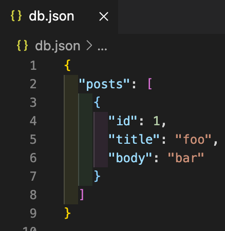
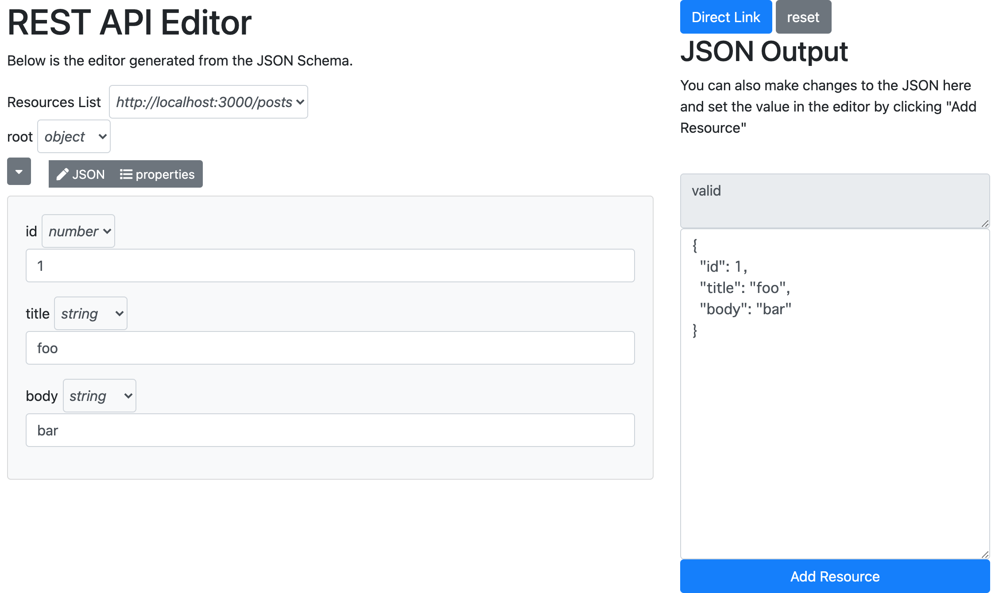
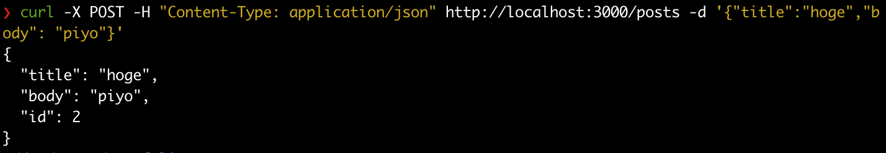
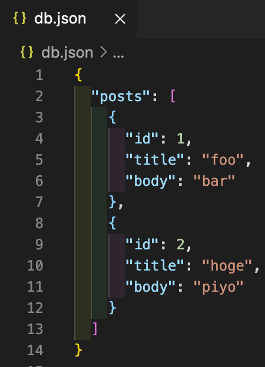

# json-server-ui

create mock data in UI using json-editor + json-server.

### Before

#### Using UI

In addition, can use the json-server REST API as is.
#### Using cURL

#### After

## Install
Install package

    npm install

Start JSON Server

    npm start

See also:
    * [json-server](https://github.com/typicode/json-server)
    * [json-editor](https://github.com/json-editor/json-editor)
